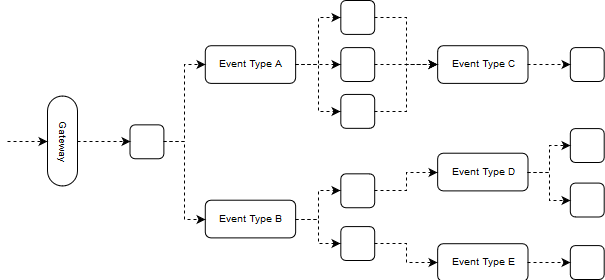

> **Warning**: Ion is currently under initial development - please **do not** use in production and have patience whilst we flesh things out!

**Ion** is a scalable, event-driven, task-oriented, processing platform. It allows you to create complex workflows as a graph of loosley coupled tasks. You define your control logic using programming languages so you are not constrained by a DSL or markdown language.

## Goals
* Scalable
* Flexible
* Extensible
* Simple

## Blueprint

Ion is built to harness the power of cloud platform services that allow it to be elastically scalable, fault tolerant and automatically managed.

The Ion platform is comprised of 4 main components:
1. [Dispatchers](#dispatchers)
2. [Jobs](#jobs)
3. [Modules](#modules)
4. [Handler](#handler)

### Dispatchers
Dispatchers can be configured to subscribe to certain event topics on an external messaging service. Multiple Dispatchers can subscribe for the same events to allow scalability. When a Dispatcher dequeues a message, it extracts requirements about the job, applies business logic rules and then dispatches a new job to be scheduled onto an appropriate execution environment.
Supported executors include:
* [Kubernetes](https://kubernetes.io/)
* [Azure Batch](https://azure.microsoft.com/en-us/services/batch/)
* [Azure Container Instances (ACI)](https://azure.microsoft.com/en-us/services/container-instances/) - Coming Soon
* Local

The Dispatcher uses `providers` to schedule jobs onto execution environments. If you wish to add support for a new executor, please consider writing a custom provider and submitting a PR.

For more details on dispatchers: please refer to the [Dispatcher docs](dispatcher/README.md)

### Jobs
A job is the unit of deployment for a Dispatcher, it contains at least 2 sub components; a module and a handler. The job should be provided with all the parameters it needs to successfully fulfil its work during dispatch.

### Modules
A module is analogous to a discrete task. It is the program that the user wishes to execute in response to a particular event. This is likely the only component a user of the platform needs to be concerned with. The module can be written in any language but should be containerized along with all its dependencies.

For more details on modules: please refer to the [Module docs](modules/README.md)

### Handler
Each module is co-scheduled with a handler. The handler provides a hook into the platform that the module can leverage. This includes getting data from previous modules, storing new data and publishing new events. As the handler is co-scheduled in a shared namespace, your module will be able to access the handler over `localhost`. The handler relies on 3 external components; a document store for metadata, a blob storage provider and a messaging system.
Currently supported metadata stores include:
* [MongoDB](https://www.mongodb.com/)
* [Azure CosmosDB](https://docs.microsoft.com/en-us/azure/cosmos-db/introduction)
* In-memory (for testing only)

Currently supported blob storage providers include:
* [Azure Blob Storage](https://azure.microsoft.com/en-gb/services/storage/)
* FileSystem (for testing only)

Currently supported messaging systems include:
* [Azure Service Bus](https://azure.microsoft.com/en-us/services/service-bus/)

The components the Handler uses are configurable, if you wish to add support for a currently unsupported technology please review the existing components, implement the interface ensuring similar behaviour and submit a PR.

For more details on handler: please refer to the [Handler docs](handler/README.md)

## Developing

Ensure you have go setup correctly then run `go get github.com/lawrencegripper/ion` to pull the source into your gopath

To check changes using the same process as the CI build run `./ci.sh` at the root directory and check the output for any errors.

This will check the `/dispatcher` and `/handler` directories. If you add an additional folder/service add your new path and add a new line into `./ci.sh` to invoke it with the correct `FOLDER` build arg.